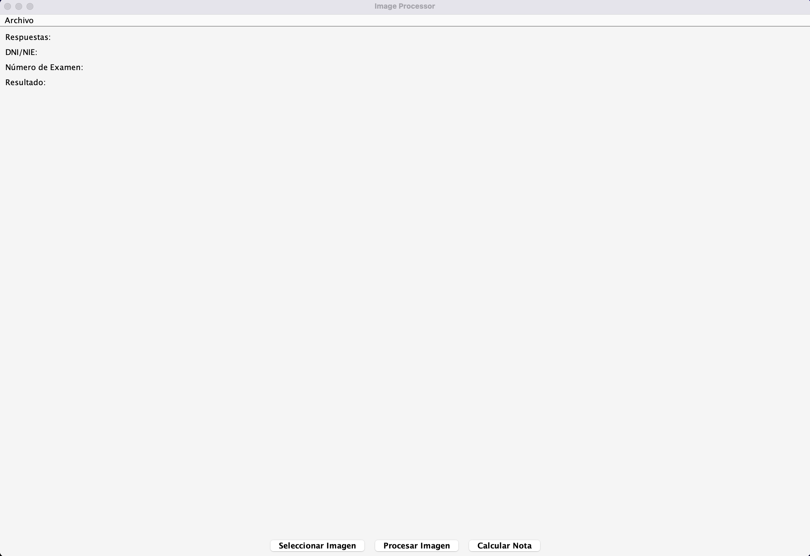
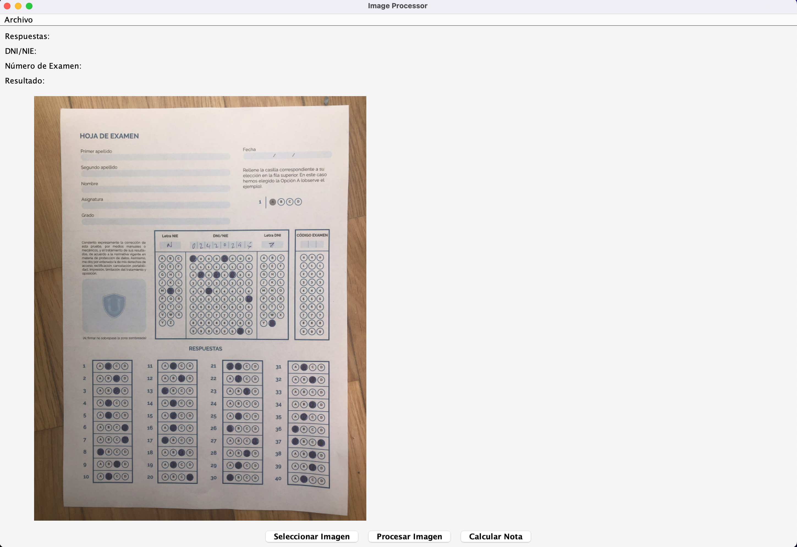
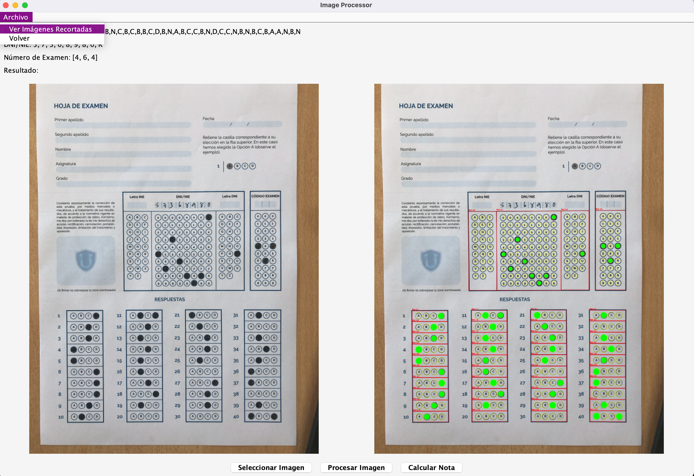
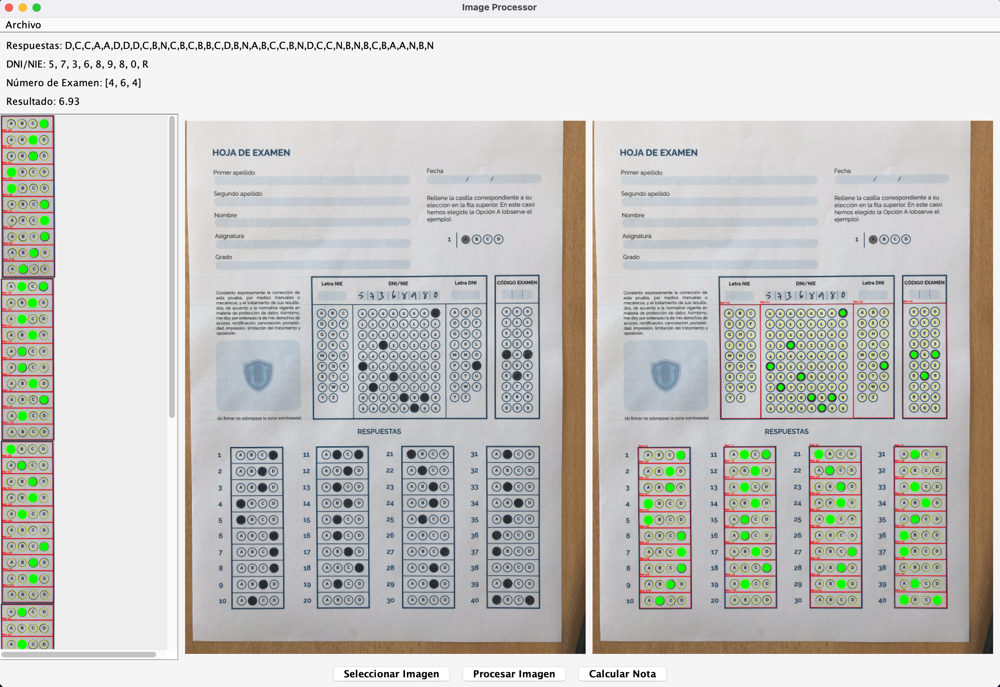

# ExamDetectorDesktop
## Descripción.
Es un proyecto de escritorio en el que seleccionamos una imagen del navegador de archivos, esta sera procesada para mediante OPENCV poder recuperar datos como el dni, el codigo de examen, ademas conseguiremos una calificacion añadiendo una lista de preguntas correctar que va relacionada al codigo de examen, de esta forma conseguiremos una calificacion final unida a unos datos.
## Instalación.
Descargar
```bash 
git clone
```
Con el comando anterior descargaremos el proyecto. para construir el ejecutable necesitamos tener instalado maven y ejecutar el siguiente comando.
```bash
mvn clean package
```
Con el comando anterior se generara un ejecutable en la carpeta target con el nombre ExamDetectorDesktop.jar

## Uso.
```bash
java -jar ExamDetectorDesktop.jar
```
Con el comando anterior se ejecutara el programa, seleccionamos una imagen y se procesara para obtener los datos.
Se abrira una pantalla con tres botones, el primero es para seleccionar la imagen, el segundo es para procesar la imagen y el tercero es para calcular la calificacion.


como se ve en la imagen anterior, se selecciona la imagen y se procesa, se obtiene los datos y se calcula la calificacion.

Al seleccionar la imagen nos muestra una miniatura de la imagen en cuestion y si damos al boton de procesar 

si damos al boton de calcular calificacion nos muestra la calificacion obtenida.
El menu archivo nos permite ver las imagenes del proceso para ver que es lo que va a obtener.


Esta plantilla es un ejemplo de como se puede hacer un reconocimiento de examenes para openCV. 
```


